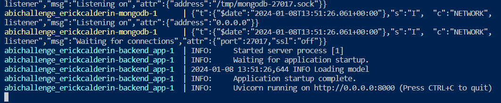
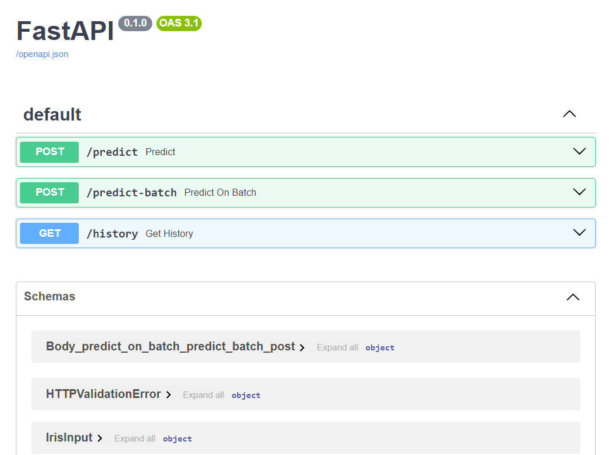
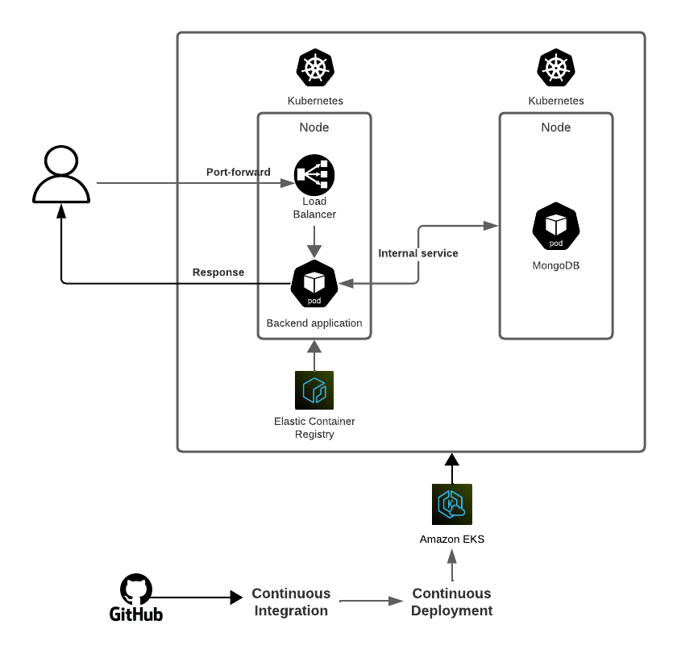

# AB InBev MLOps Challenge

## Table of Contents

<!--ts-->
* [Directory layout](#directory-layout)
* [Running the app with Docker](#running-the-app-with-docker)
* [Notebooks](#notebooks)
* [Application architecture in production](#application-architecture-in-production)
* [Checkpoints](#checkpoints)
* [Conclusions](#conclusions)
<!--te-->

## Directory layout

```
.
├── backend_app
│   └── src
│       ├── controllers
│       ├── schemas
│       └── services
├── frontend_app
├── notebooks
└── tests

8 directories

```

## Running the app with Docker

Run `docker-compose up --build` to start the services at first time or `docker-compose up` to start services after the initial build

The output should look like this:



* ### Backend service

Swagger documentation for FastAPI backend:



* `/predict`: Predict a sample based on four features.
* `/predict-batch`: Predict a batch of samples, the file `test/iris_test.csv` is provided to test this endpoint.
* `/history`: Get the history of all the predictions.

Remember stop the services with `docker-compose down`

## Notebooks

Notebook in `notebooks/` directory to train a basic model with RandomForestClassifier using Iris dataset.

## Application architecture in production



## Checkpoints

- [x] Reproducibility
- [x] Model deployment
- [x] Dependency and enviroment management
- [x] Containerization (Docker with multi-stage)
- [x] Tests
- [ ] Frontend application with Streamlit
- [ ] Linter

## Conclusions

During this development I faced different challenges 
